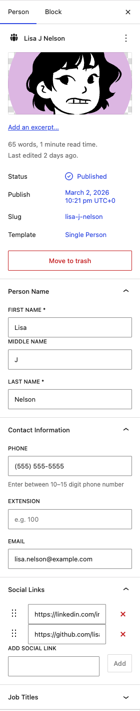
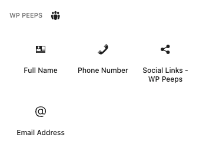
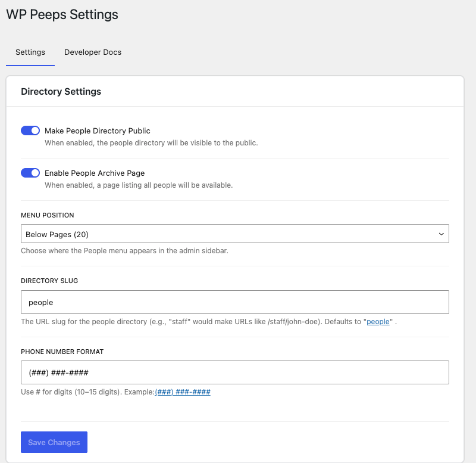

# Peeps

[](https://playground.wordpress.net/?blueprint-url=https://raw.githubusercontent.com/philhoyt/WP-Peeps/main/_playground/blueprint.json)

A WordPress plugin for managing and displaying people profiles.

## Description

WP Peeps is a WordPress plugin that helps you create and manage a directory of people on your website. Perfect for displaying leadership, team rosters, or employee directories.

### Requirements

-   WordPress 6.6 or higher
-   PHP 8.0 or higher

### Features

-   Custom post type for managing people profiles
-   Block templates for single person posts and archive pages
-   Configurable phone number formatting
-   Custom URL structure for people profiles
-   Public/private directory option
-   Full Name block
-   Phone Number block
-   Email Address block
-   Social Links block

## Installation

1. Download the latest release from GitHub
2. Upload the plugin files to the `/wp-content/plugins/peeps` directory
3. Activate the plugin through the 'Plugins' screen in WordPress
4. Go to People → Settings to configure the plugin options

## Screenshots

### Person Post Frontend


### Person Post Editor Fields


### Available Blocks


### Settings Page


## Development

-   `npm install` - Installs dependencies

#### Available Scripts

-   `npm start` - Starts the development build process with hot reloading
-   `npm run build` - Creates a production build
-   `npm run format` - Formats JavaScript files using Prettier
-   `npm run lint:css` - Lints CSS/SCSS files
-   `npm run lint:js` - Lints JavaScript files
-   `npm run plugin-zip` - Creates a distributable plugin zip file

#### Testing

To generate test data for development:

```bash
wp eval-file wp-content/plugins/wp-peeps/bin/generate-test-data.php 20
```

This will create 20 test people profiles in your WordPress installation.

## Changelog

### 1.3.0

-   Added block template for archive pages
-   Archive template includes featured image, name, contact information, and social links

### 1.2.0

-   Automatic permalink flush on plugin activation
-   Automatic permalink flush on plugin deactivation
-   Added notice when changing settings that affect permalinks (slug, public status, archive)

### 1.1.0

-   Added block template registration for single person posts
-   Default template includes featured image, full name, contact information, and social links
-   Template is customizable through the Site Editor

### 1.0.0

-   Stable release
-   Comprehensive code audit and security improvements
-   Fixed XSS vulnerabilities in social links and prefix fields
-   Added proper validation and sanitization for all inputs
-   Improved error handling and logging
-   Code quality improvements and complete PHPDoc documentation
-   Performance optimizations (reduced database queries)
-   Fixed infinite loop issue in title update function
-   Added namespace declarations to all render callbacks
-   Standardized path usage throughout the plugin

### 0.1.1

-   Disable post title editing

### 0.1.0-beta.3

-   Fixed issue with social links styling
-   Adjust phone number formatting to all between 10 and 15 digits
-   Added toggle to disable archive view
-   Added settings for menu position

### 0.1.0-beta.2

-   Removed Job Title field
-   Improved editor experience
-   Added inline editing for prefixing phone and email
-   Improved social links functionality
-   Full Name, Email, and Phone now display data in query loop editor
-   Various code cleanup and optimizations

### 0.1.0-beta.1

-   Initial beta release
-   Added Full Name block
-   Added Phone Number block
-   Added Email Address block
-   Added Social Links block
-   Custom phone number formatting

### 0.1.0

-   Initial release
-   People directory custom post type
-   Admin settings page
-   Phone number formatting
-   Required name fields
-   Contact information fields

## Credits

Contributors: Phil Hoyt
Tags: directory, people, staff, team, employees
Tested up to: 6.9
Stable tag: 1.3.0
License: GPL-2.0-or-later
License URI: https://www.gnu.org/licenses/gpl-2.0.html
